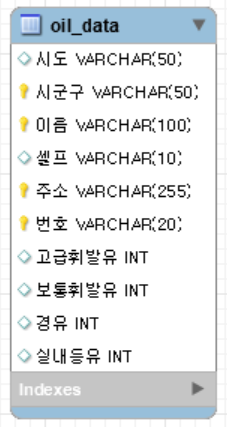

# 백수저🥄
## ✔️ 팀원 소개
| 백하은 | 안형진 | 전수연 | 조해원 | 
|--|--|--|--|
| 백조교 | 코딩하는 돌아이 | 원투쑤리 | 해드워드조 |
|||||

# 전국 주유소 유가 및 전기차 충전소 가격 조회 시스템
## ✔️ 프로젝트 기간
2024.10.11 ~ 2024.10.15

## ✔️ 프로젝트 개요
소비자라면 막상 주유하고 나왔는데 더 싼 주유소 발견해서 아쉬웠다거나, 타지와서 전기차 충전하는 곳이 어디 있는지 모르겠다는 생각을 한번 씩은 해봤을 것이다.
그리하여 이 프로젝트는 전국 주유소와 전기차 충전소의 위치를 파악하고 가격 정보를 비교할 수 있도록 설계되었다. 분산된 정보를 한 곳에서 제공함으로써 소비자들이 최저가 주유소와 충전소를 손쉽게 찾고자 한다.

## ✔️ 프로젝트 목표
- 전국 실시간 주유소 유가 현황 제공
> 실시간으로 업데이트 된 정보를 동적크롤링으로 수집하고, 시군구 단위로 조회하여 주유소별 유가를 확인하고, 해당 위치를 지도에 표시해 시각적으로 보여준다.
- 지역별 평균 유가 추이와 전년 대비 증감 분석
> csv 파일로 연도 및 월별로 지역별 평균 유가를 계산하고, 연료 종류별 평균 가격과 전년 대비 가격 변동을 분석한 결과를 토대로 그래프와 표를 제공하여 변화 추이를 파악한다.
- 전기차 충전소 위치 및 업체별 충전 비용 비교
> 두 개의 사이트에서 가져온 데이터를 토대로 전기차 충전소 위치와 업체별 충전 요금을 통합하고, 표와 그래프로 비교하여 사용자들이 쉽게 확인할 수 있도록 시각화한다. 
- 자주 묻는 질문(FAQ) 제공
> 전기차 충전과 관련하여 주요 3개 업체의 FAQ를 크롤링하여 소비자들이 궁금해할 만한 정보를 제공한다.

## ✔️ Requirements_oil.py
```python
pip install streamlit-folium PyMySQL
```
```SQL
CREATE DATABASE oil;
```
* 카카오 지도 API [생성 방법](https://apis.map.kakao.com/web/guide/)
* config.ini
* oil.db(MYSQL) 혹은 oil_data.csv
* madecsv.ipynb 실행(3, 4번째 셀은 필요에 따라 진행)

```
### config.ini
[MYSQL]
host=
user=
password=
db=oil

[KAKAO_API]
key=
```

## ✔️ 기술스택


## 폴더 구조
```bash
├── images
│ ├──().이미지확장자
├── pages
│ ├── oil.py
│ ├── avg.py
│ ├── 
│ ├──
│ └── FAQ.py
├── Home.py
├── oil_data.csv
├── 주유소_지역별_평균판매가격(경유).csv
├── 주유소_지역별_평균판매가격(고급).csv
├── 주유소_지역별_평균판매가격(등유).csv
├── 주유소_지역별_평균판매가격(보통).csv
├── EV_faq3.csv
└── tago_faq.csv

``` 

## ✔️ ERD



## ✔️ 기능 소개
1. DB 구축
> 유가 가격 정보 데이터 구축
 - 주유소 실시간 데이터
 - 연도별 데이터
> 전기차 충전 정보 데이터 구축
 - 충전소 위치 데이터 
 - 충전소 가격 데이터

2. streamlit
> 내연기관차 주유와 전기자동차 충전에 대한 종합적인 정보 제공 페이지 구축

3. 결과
| 주유소 유가 현황 | 유가 추이 및 증감 분석 |
|--|--|
|||
| 충전소 비용 비교 | FAQ | 
|||

## ✔️ 프로젝트 회고
백하은 : 

안형진 :  

전수연 : 시간이 좀 더 있었다면 데이터를 보강하고 싶고, 다른 기능과 결합할 수 있는 방안을 고민해보고 싶은 아쉬움이 있다.

조해원 : 실제로 코드를 짜보면서 어려움을 느꼈지만 끝까지 노력한 팀원들 덕분에 잘 진행될 수 있었다.
